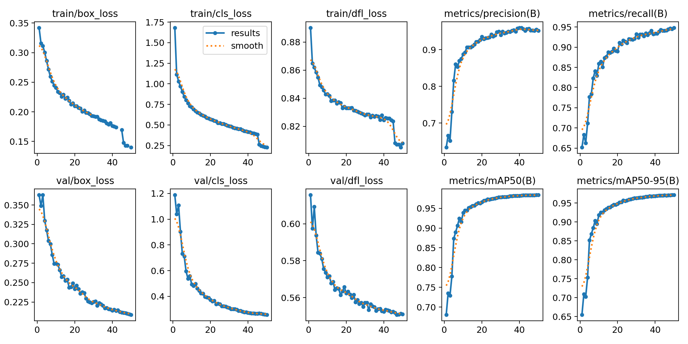
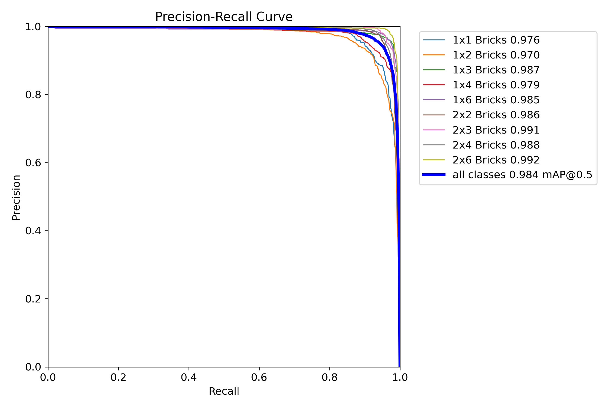
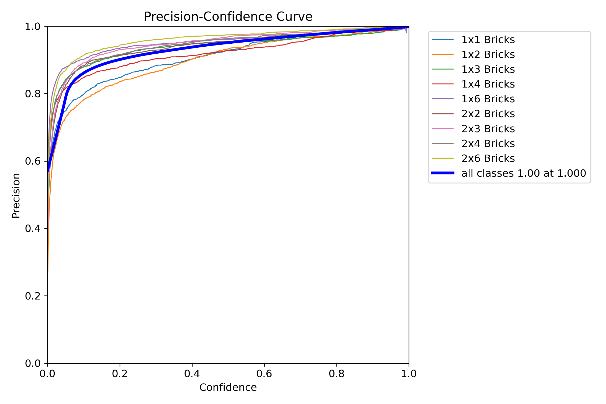
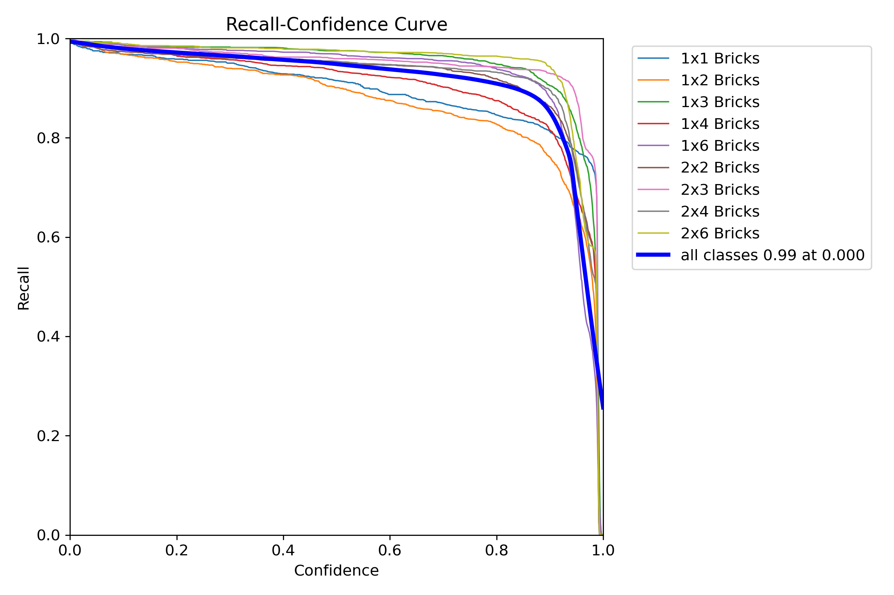
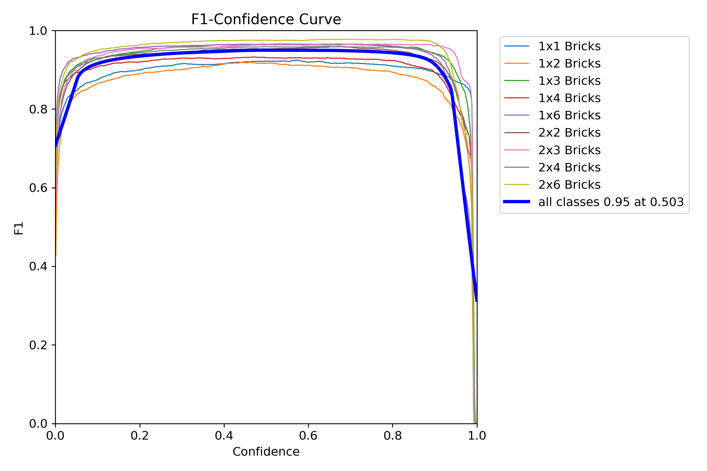
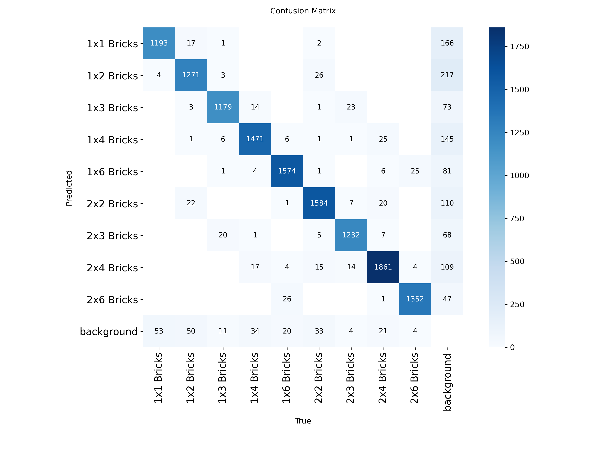
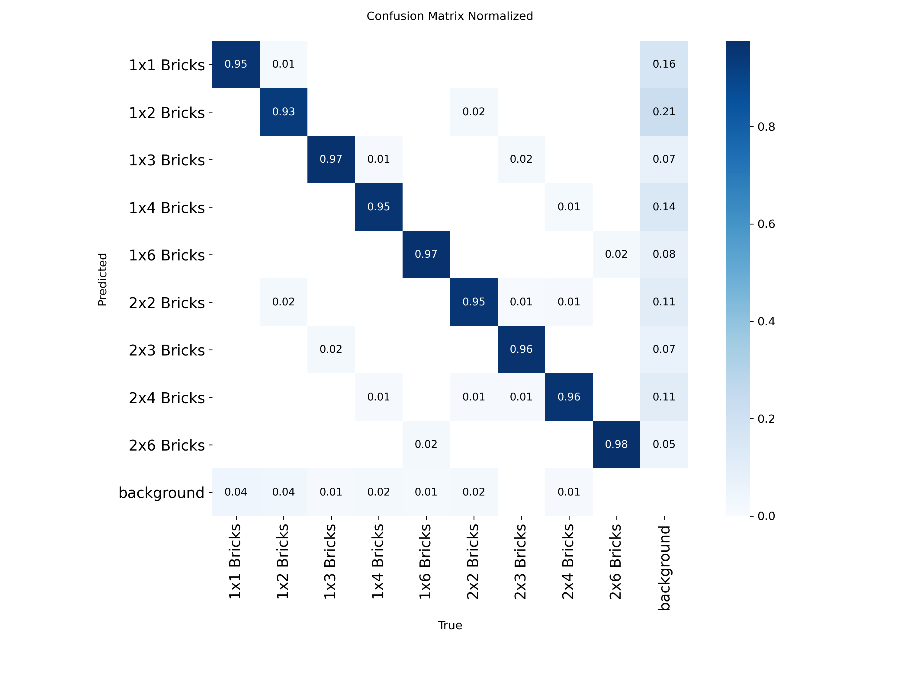

# AI & Computer Vision Documentation

## Overview

The AI subsystem runs on **Raspberry Pi 5** and is responsible for:
- **Image capture** from Raspberry Pi Camera Module
- **Real-time inference** using YOLO11 neural network
- **Brick classification** into 5 categories (1×1, 1×2, 1×4, 2×2, 2×4)
- **Serial communication** with STM32 (receive capture commands, send results)
- **Graceful error handling** and timeout management

This section covers model training, dataset structure, inference pipeline, and observed performance characteristics.

---

## Hardware Setup

### Raspberry Pi 5

#### Specifications
- **CPU**: ARM Cortex-A76 (quad-core, 2.4 GHz)
- **RAM**: 8 GB (recommended; 4 GB minimum)
- **GPU**: VideoCore VII (optional acceleration not currently used)
- **Power**: USB-C 5A PSU (critical; insufficient power causes random failures)

#### Software Stack
- **OS**: Raspberry Pi OS (Bookworm, 64-bit)
- **Python**: 3.10 or 3.11
- **Key packages**: OpenCV, PyTorch, Ultralytics YOLO

#### Installation Commands (typical)
```bash
# Install system dependencies
sudo apt-get update
sudo apt-get install python3-pip python3-opencv libatlas-base-dev

# Install Python packages
pip install torch torchvision opencv-python ultralytics

# Optional: GPU acceleration (requires specific PyTorch build)
# pip install torch torchvision -f https://download.pytorch.org/whl/torch_stable.html
```

### Raspberry Pi Camera Module

#### Specifications
- **Sensor**: IMX708 (12 MP, if using Camera Module 3) or IMX219 (8 MP, v2)
- **Field of view**: ~77° (wide angle)
- **Interface**: CSI ribbon cable (connected to dedicated camera port on Pi)
- **Resolution**: Configurable; default 1280×720 (HD) for speed

#### Image Capture Setup
```python
from picamera2 import Picamera2
import numpy as np

camera = Picamera2()
camera.configure(camera.create_preview_configuration(main={"format": "RGB888", "size": (1280, 720)}))
camera.start()

# Capture frame
frame = camera.capture_array()  # Returns numpy array (720, 1280, 3)
```

#### Positioning
- **Height above belt**: ~15–20 cm (allows 1280×720 FOV to cover belt width)
- **Angle**: Perpendicular to brick motion (minimizes perspective distortion)
- **Lighting**: ~500–1000 lux (ambient + optional LED ring light)

**Camera angle rationale**: Bricks captured nearly head-on minimize appearance variation. This was the training dataset perspective; different angles cause misclassification (see "Known Issues").

---

## YOLO11 Model

### Overview

**YOLO11** (You Only Look Once v11) is a state-of-the-art real-time object detection model from Ultralytics (released Jan 2025). For this project, it's used in a **classification mode** (single dominant class per image), not traditional bounding-box detection.

#### Key Characteristics
- **Architecture**: Efficient CNN backbone + detection head (optimized for mobile/edge)
- **Inference speed**: ~30–50 ms on Raspberry Pi 5 (GPU: ~10 ms with ONNX)
- **Model size**: ~6 MB (nano variant) to 50+ MB (large variant)
- **Output**: Bounding boxes + class probabilities (filtered for highest confidence class)

#### Current Configuration
- **Model variant**: YOLO11m (medium; balance of speed/accuracy)
- **Input resolution**: 640×640 (standard YOLO input)
- **Confidence threshold**: 0.7 (ignore detections below 70% confidence)
- **Target classes**: 5 LEGO brick types

### Training Dataset

#### Dataset Structure
YOLO11 expects images organized in a specific format (following Ultralytics convention):

```
dataset/
├── images/
│   ├── train/
│   │   ├── img_001.jpg
│   │   ├── img_002.jpg
│   │   └── ...
│   ├── val/
│   │   ├── img_101.jpg
│   │   └── ...
│   └── test/
│       └── ...
├── labels/
│   ├── train/
│   │   ├── img_001.txt
│   │   ├── img_002.txt
│   │   └── ...
│   ├── val/
│   │   └── ...
│   └── test/
│       └── ...
└── data.yaml
```

#### Label Format (YOLO format)
Each `.txt` file contains one or more lines (one per brick in image):
```
<class_id> <x_center> <y_center> <width> <height>
```

**Normalized coordinates**: All values 0–1 (relative to image width/height)

**Example** (`img_001.txt`):
```
2 0.45 0.52 0.15 0.20
```
Means: Class 2 (1×4 Bricks), centered at 45% horizontal, 52% vertical, 15% width, 20% height.

#### data.yaml Configuration
```yaml
path: /path/to/dataset
train: images/train
val: images/val
test: images/test

nc: 5
names:
  0: 1x1 Bricks
  1: 1x2 Bricks
  2: 1x4 Bricks
  3: 2x2 Bricks
  4: 2x4 Bricks
```

#### Current Training Data (Observed Issues)

**Dataset composition:**
- ~250 images total (~50 per class, limited collection)
- Single camera angle (top-down, ~15 cm height)
- Homogeneous background (white cloth/table)

**Known labeling errors:**
- **1×4 vs 2×4**: These bricks appear nearly identical when viewed from above; difficult to distinguish without side angle
- **1×2 vs 2×2**: Similarly problematic; top-down view doesn't reveal the 1-unit depth difference
- **Duplicate/mislabeled entries**: A few bricks double-labeled with wrong class during manual annotation

**Impact**: Misclassification of specific brick pairs occurs ~10–15% of the time.

#### Dataset Generation Workflow (Recommended Fix)

The system itself can be used to auto-generate a corrected training dataset:

1. **Capture phase**: Run system in "capture mode" (no sorting); save every image + timestamp
2. **Review phase**: Manually inspect and correct all labels (verify each image matches intended class)
3. **Multi-angle phase**: Rotate or tilt camera slightly; capture each brick type from 3–5 angles
4. **Augmentation phase**: Use YOLO data augmentation (rotation, color jitter, blur) to increase dataset
5. **Retrain phase**: Run training script; validate on test set
6. **Deploy phase**: Replace old model with retrained version

---

## Training Pipeline

### Google Colab Setup

Training typically happens on **Google Colab** (free GPU access, beats Raspberry Pi CPU training by 100×).

#### Training Script (Python)

```python
from ultralytics import YOLO

# Load model (nano, small, medium variants available)
model = YOLO('yolo11m.pt')

# Train
results = model.train(
    data='/content/drive/MyDrive/dataset/data.yaml',
    epochs=100,
    imgsz=640,
    batch=32,
    patience=20,           # Early stopping
    device=0,              # GPU
    save_period=10,
    plots=True,
    augment=True,
)

# Export to ONNX for Raspberry Pi
model.export(format='onnx')
```

#### Training Hyperparameters
| Parameter | Value | Notes |
|-----------|-------|-------|
| Epochs | 100 | Stop early if validation plateaus |
| Batch size | 32 | Per-GPU batch; scale down if OOM |
| Image size | 640×640 | YOLO standard; smaller = faster but less accurate |
| Learning rate | 0.001 (auto) | Let YOLO tune |
| Augmentation | Enabled | Rotation, color jitter, blur, etc. |
| Patience (early stop) | 20 epochs | Stop if val loss doesn't improve |

#### Expected Training Time
- **Colab GPU**: ~2–5 minutes for 100 epochs on 250 images
- **Raspberry Pi (no acceleration)**: ~1–2 hours (not recommended; use Colab)

#### Validation Metrics

After training, metrics are generated automatically by YOLO. The plots below show typical training results:

**Training Results Summary**


**Precision-Recall Curve**

This curve shows how precision and recall trade off across different confidence thresholds. The area under the curve (AUC) indicates overall detection quality.

**Precision Curve**

Precision shows what percentage of predicted detections are actually correct. Higher curves indicate better performance.

**Recall Curve**

Recall shows what percentage of actual bricks are successfully detected. This is critical for ensuring no bricks slip through unclassified.

**F1 Score Curve**

The F1 score is the harmonic mean of precision and recall. A score of 1.0 indicates perfect detection; lower scores (0.5–0.8 on problematic classes) suggest difficulty distinguishing similar brick types.

**Key metrics:**
- **P (Precision)**: Of predicted positives, how many correct
- **R (Recall)**: Of actual positives, how many detected
- **mAP50**: Mean Average Precision @ IoU 0.5 threshold

---

## Confusion Matrix Analysis

The confusion matrix reveals which brick types are commonly misclassified:

**Raw Confusion Matrix (counts)**


**Normalized Confusion Matrix (percentages)**


**Interpretation:**
- Diagonal values (top-left to bottom-right) are correct predictions
- Off-diagonal values show misclassifications
- The normalized version makes it easier to spot problem areas as percentages
- 1×4 vs 2×4 and 1×2 vs 2×2 pairs show elevated off-diagonal values, confirming the single-angle dataset limitation

---

## Inference Pipeline (Raspberry Pi)

### Python Application Structure

#### Main Entry Point (`main.py`)
```python
#!/usr/bin/env python3

import cv2
import serial
import threading
from inference import YOLOInference
from communication import SerialComm
from gui import GUI  # Optional

# Initialize
camera = Camera()
inference = YOLOInference(model_path='yolo11m.onnx')
comm = SerialComm(port='/dev/ttyUSB0', baudrate=115200)
gui = GUI()  # Optional PyQt interface

# Start event threads
inference_thread = threading.Thread(target=inference_loop, daemon=True)
serial_thread = threading.Thread(target=serial_listener, daemon=True)

inference_thread.start()
serial_thread.start()

# Main GUI loop (or simple console loop)
gui.run()
```

#### Inference Loop (`inference.py`)
```python
import queue
import threading
import time
from ultralytics import YOLO

class YOLOInference:
    def __init__(self, model_path):
        self.model = YOLO(model_path)
        self.request_queue = queue.Queue()
        self.result_queue = queue.Queue()
        
    def inference_loop(self):
        while True:
            try:
                # Wait for image from camera
                frame = self.request_queue.get(timeout=1)
                
                # Run inference
                start = time.time()
                results = self.model(frame, conf=0.7, imgsz=640)
                elapsed = time.time() - start
                
                # Extract highest confidence class
                if results[0].boxes:
                    best_box = max(results[0].boxes, key=lambda b: b.conf)
                    class_id = int(best_box.cls[0])
                    class_name = self.model.names[class_id]
                    confidence = float(best_box.conf[0])
                    
                    self.result_queue.put({
                        'class': class_name,
                        'confidence': confidence,
                        'inference_time_ms': elapsed * 1000
                    })
                else:
                    # No detection
                    self.result_queue.put({'error': 'No brick detected'})
                    
            except queue.Empty:
                continue
            except Exception as e:
                self.result_queue.put({'error': str(e)})
    
    def capture_and_infer(self, frame):
        """Synchronous wrapper; blocks until result ready (with timeout)."""
        self.request_queue.put(frame)
        try:
            result = self.result_queue.get(timeout=5)  # 5 second timeout
            return result
        except queue.Empty:
            return {'error': 'Inference timeout'}
```

#### Serial Communication (`communication.py`)
```python
import serial
import threading

class SerialComm:
    def __init__(self, port, baudrate):
        self.port = serial.Serial(port, baudrate=baudrate, timeout=1)
        self.on_command = None  # Callback for commands from STM32
        
    def send(self, message):
        """Send message to STM32."""
        self.port.write((message + '\n').encode())
    
    def listen_loop(self):
        """Background thread; reads incoming commands."""
        while True:
            line = self.port.readline().decode(errors='ignore').strip()
            if line:
                if self.on_command:
                    self.on_command(line)
    
    def on_CMRA_command(self, camera, inference):
        """Handle CMRA command from STM32."""
        # Capture image
        frame = camera.capture()
        
        # Run inference (blocking, 5 second timeout built-in)
        result = inference.capture_and_infer(frame)
        
        # Send result back to STM32
        if 'class' in result:
            self.send(result['class'])
            print(f"Sent: {result['class']} (conf={result['confidence']:.2f})")
        else:
            self.send('ERR')
            print(f"Error: {result.get('error', 'Unknown')}")
```

#### GUI (Optional, `gui.py`)
```python
import sys
from PyQt5.QtWidgets import QMainWindow, QPushButton, QLabel, QVBoxLayout, QWidget
from PyQt5.QtCore import QThread, pyqtSignal

class CapturePushButton(QPushButton):
    def __init__(self, comm, camera, inference):
        super().__init__("Capture & Run Inference")
        self.comm = comm
        self.camera = camera
        self.inference = inference
        self.clicked.connect(self.on_click)
        
    def on_click(self):
        frame = self.camera.capture()
        result = self.inference.capture_and_infer(frame)
        # Display result in label
        if 'class' in result:
            print(f"Result: {result['class']}")
        else:
            print(f"Error: {result.get('error')}")

class GUI(QMainWindow):
    def __init__(self, comm, camera, inference):
        super().__init__()
        # ... layout setup ...
        self.capture_btn = CapturePushButton(comm, camera, inference)
        # ... add to layout ...
```

**Python GUI in Action**

The GUI provides manual control buttons for capture, inference, and routing for testing and debugging.

### Inference Timing

**End-to-end inference time per frame:**

| Stage | Time | Notes |
|-------|------|-------|
| Image capture (camera) | 10–20 ms | Hardware latency |
| Model inference | 30–50 ms | YOLO11m on Raspberry Pi CPU |
| Result parsing + sending | 5–10 ms | Python + serial |
| **Total** | **50–80 ms** | (Can be parallelized with capture) |

**Throughput**: ~12–20 inferences/second on Raspberry Pi 5 (ample for ~1 brick every 15 seconds system requirement).

---

## Known Issues & Mitigations

### Issue 1: Misclassification (1×4 vs 2×4, 1×2 vs 2×2)

**Symptom**
- Some 1×4 bricks routed to bin 4 (2×4 bin)
- Some 1×2 bricks routed to bin 3 (2×2 bin)
- Frequency: ~10–15% of affected brick types

**Root Cause**
- Training dataset captured from single fixed angle (top-down)
- These brick pairs appear visually identical from above; depth dimension invisible
- Manual annotation errors in original dataset (a few bricks double-labeled)

**Example**: A 1×4 brick (1 stud × 4 studs, viewed top-down) looks like a 2×4 brick (2 studs × 4 studs) if the 1-stud dimension aligns with camera perspective.

**Evidence from Confusion Matrix**: The normalized confusion matrix shows elevated cross-terms between 1×4↔2×4 and 1×2↔2×2, confirming this systematic issue.

**Mitigation (Long-term)**
1. Use the operating system to capture high-quality dataset:
   - Run in "capture mode": every brick image saved to disk
   - Manually verify and correct labels (human review pass)
   - Rotate camera or physically tilt bricks to capture multiple angles per brick
   - Combine with YOLO data augmentation (random rotation/color/blur)

2. Retrain YOLO11 with corrected, multi-angle dataset
3. Achieve >95% accuracy on problematic pairs
4. Redeploy model to Pi

**Mitigation (Short-term)**
- Accept ~10% error rate on confusable pairs
- Use system for one-way sorting (no feedback on errors)
- Manually separate bricks post-collection if precision matters

### Issue 2: Inference Timeout

**Symptom**
- Pi doesn't respond within 5 seconds
- STM32 times out; brick passes unsorted
- Usually observed on very first inference (model loading overhead)

**Root Cause**
- First YOLO inference is slow (~1–2 seconds) due to model warm-up
- Subsequent inferences are ~50 ms (cached weights in memory)
- Rarely: network I/O spike or background task preempts inference thread

**Mitigation**
- Run "warm-up" inference on Pi startup (dummy image)
- Priority scheduling: run inference thread at higher OS priority
- Use smaller model variant (yolo11n) if latency critical (trades accuracy)

### Issue 3: Camera Focus/Exposure

**Symptom**
- Blurry images
- Under/over-exposed frames
- Inconsistent color temperature

**Root Cause**
- Raspberry Pi Camera Module autofocus/autoexposure can drift
- Lighting varies; no white balance lock

**Mitigation**
- Lock camera settings after warm-up:
  ```python
  camera.set_controls({
      "AnalogueGain": 1.0,        # Fixed gain
      "ExposureTime": 10000,      # 10 ms exposure
      "AwbMode": controls.AwbModeEnum.Tungsten,  # Fixed color temp
  })
  ```
- Use consistent, dedicated LED ring light (~500–1000 lux)

---

## Deployment & Configuration

### Step 1: Install Dependencies
```bash
sudo apt-get install python3-pip python3-opencv libatlas-base-dev
pip install ultralytics torch torchvision opencv-python pyserial
```

### Step 2: Place Model File
```bash
# Copy trained YOLO11m model to Pi
scp model.pt pi@raspberrypi:/home/pi/sorter/models/yolo11m.pt
```

### Step 3: Configure Serial Port
```python
# In communication.py, set correct port:
comm = SerialComm(port='/dev/ttyUSB0', baudrate=115200)
# Or GPIO UART: port='/dev/ttyAMA0'
```

### Step 4: Run Application
```bash
cd /home/pi/sorter
python3 main.py
```

On startup:
- Model loads (~2 seconds)
- Warm-up inference runs (~1–2 seconds)
- System waits for EVT READY from STM32
- Begins accepting CMRA commands

---

## Performance Metrics (Observed)

| Metric | Value | Notes |
|--------|-------|-------|
| Model size | 6 MB (nano) to 30 MB (medium) | Affects load time + RAM |
| Inference speed | 30–50 ms | CPU; ~10 ms with GPU/ONNX |
| Memory usage | 200–500 MB | During inference (depends on model size) |
| Accuracy (overall) | ~90% mAP50 | On validation set; lower on problematic pairs |
| Accuracy (problematic pairs) | ~80–85% | 1×4 vs 2×4, 1×2 vs 2×2 |
| Timeout frequency | <1% | With warm-up; rare on normal operation |

---

## Future Improvements

1. **Multi-angle training**: Capture dataset from 3–5 viewpoints; retrain
2. **Ensemble models**: Run two models, vote on ambiguous cases
3. **GPU acceleration**: Use ONNX Runtime + GPU backend (requires Pi 5 GPU drivers)
4. **Model quantization**: Convert to int8; reduce model size 4× (minor accuracy loss)
5. **Continuous learning**: System auto-updates labels; periodic retraining in cloud
6. **Brick size filtering**: Pre-filter detections by brick bounding box dimensions (heuristic check)

---

## References

- **Ultralytics YOLO11 Docs**: https://docs.ultralytics.com/models/yolo11/
- **Raspberry Pi Camera Documentation**: https://www.raspberrypi.com/documentation/accessories/camera.html
- **PyTorch on ARM**: https://pytorch.org/get-started/locally/
- **YOLO Training Guide**: https://docs.ultralytics.com/modes/train/
